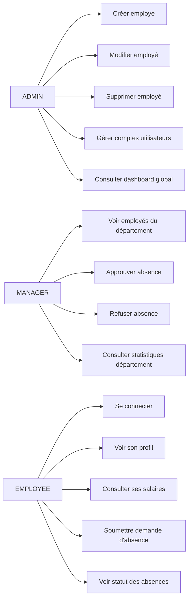
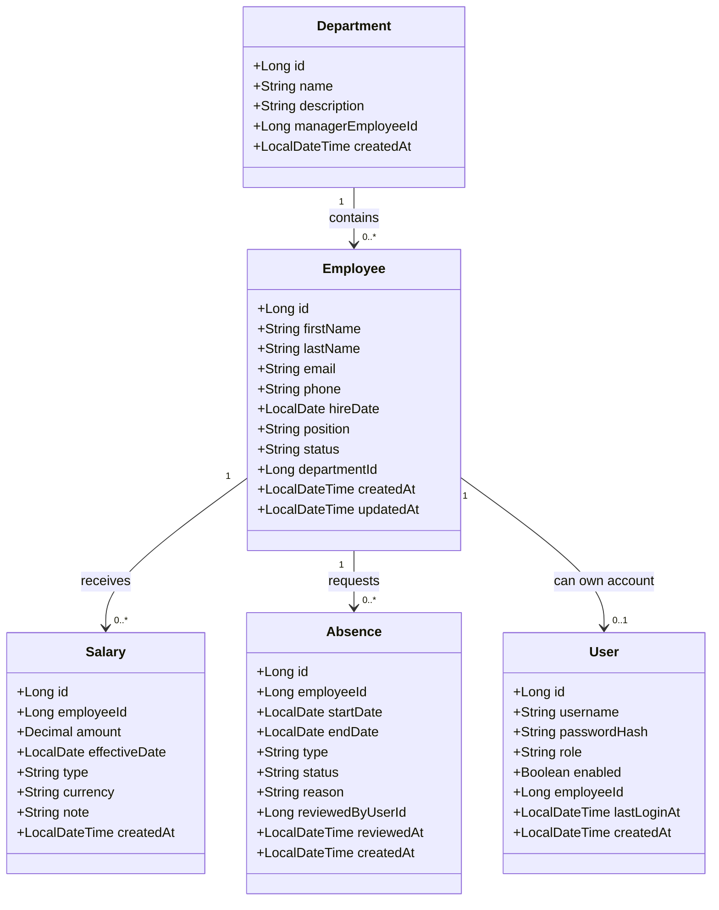

# Phase 1 — Livrables complétés (version de démarrage)

Ce document sert de base de travail pour la phase 1. Il peut être enrichi au fur et à mesure.

## 1) Tableau des rôles et permissions

| Acteur | Peut faire | Ne peut PAS faire |
|---|---|---|
| ADMIN | Créer/modifier/supprimer les employés, gérer les comptes, consulter toutes les données, gérer les départements | Se connecter sans authentification JWT sur les routes protégées |
| MANAGER | Consulter les employés de son département, approuver/refuser les absences de son département, consulter les salaires selon politique interne | Supprimer un employé, gérer les comptes admin, accéder aux absences d'autres départements |
| EMPLOYEE | Se connecter, consulter son profil, consulter ses salaires, soumettre une demande d'absence, consulter le statut de ses demandes | Créer/supprimer des employés, approuver des absences, consulter les données d'autres employés |

### Réponses (compréhension)

1. Plusieurs rôles limitent les risques de sécurité, séparent les responsabilités et évitent les erreurs humaines d'un compte unique trop puissant.
2. Le moindre privilège consiste à donner uniquement les droits nécessaires pour accomplir une tâche, sans droits supplémentaires.
3. Le compte employé est créé par un ADMIN (ou un workflow admin contrôlé), pas par auto-inscription libre.

## 2) Use Case (Mermaid)

## 3) Diagramme de classes UML (Mermaid)

## 4) MCD (version texte concise)

- **Department**
  - `id` BIGINT (PK)
  - `name` VARCHAR(100) (UNIQUE, NOT NULL)
  - `description` VARCHAR(255)
  - `manager_employee_id` BIGINT (FK -> Employee.id, nullable)

- **Employee**
  - `id` BIGINT (PK)
  - `first_name` VARCHAR(100) (NOT NULL)
  - `last_name` VARCHAR(100) (NOT NULL)
  - `email` VARCHAR(150) (UNIQUE, NOT NULL)
  - `phone` VARCHAR(30)
  - `hire_date` DATE (NOT NULL)
  - `position` VARCHAR(100) (NOT NULL)
  - `status` ENUM('ACTIVE','INACTIVE') (NOT NULL)
  - `department_id` BIGINT (FK -> Department.id, NOT NULL)

- **Salary**
  - `id` BIGINT (PK)
  - `employee_id` BIGINT (FK -> Employee.id, NOT NULL)
  - `amount` DECIMAL(12,2) (NOT NULL)
  - `effective_date` DATE (NOT NULL)
  - `type` ENUM('MENSUEL','ANNUEL') (NOT NULL)
  - `currency` CHAR(3) (NOT NULL, default 'EUR')

- **Absence**
  - `id` BIGINT (PK)
  - `employee_id` BIGINT (FK -> Employee.id, NOT NULL)
  - `start_date` DATE (NOT NULL)
  - `end_date` DATE (NOT NULL)
  - `type` ENUM('CONGE_PAYE','MALADIE','SANS_SOLDE','AUTRE') (NOT NULL)
  - `status` ENUM('EN_ATTENTE','APPROUVE','REFUSE') (NOT NULL)
  - `reason` VARCHAR(500)
  - `reviewed_by_user_id` BIGINT (FK -> User.id, nullable)

- **User**
  - `id` BIGINT (PK)
  - `username` VARCHAR(80) (UNIQUE, NOT NULL)
  - `password_hash` VARCHAR(255) (NOT NULL)
  - `role` ENUM('ADMIN','MANAGER','EMPLOYEE') (NOT NULL)
  - `enabled` BOOLEAN (NOT NULL, default true)
  - `employee_id` BIGINT (FK -> Employee.id, UNIQUE, nullable)

## 5) Remarques de conception

- La relation `Employee -> User` est optionnelle (`0..1`) car un employé peut exister en base avant création de compte.
- `manager_employee_id` dans `Department` reste nullable pour permettre la création du département avant affectation d'un manager.
- Le mot réservé SQL `user` est évité au niveau physique en nommant la table `users`.
